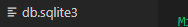

# display

- display : block
  - 줄 바꿈이 일어나는 요소
  - 화면 크기 전체의 가로 폭을 차지한다.
  - 블록 레벨 요소 안에 인라인 레벨 요소가 들어갈 수 있음.
  - ex) div/ul/ol/li/p/hr/form 등
- display : inline
  - 줄 바꿈이 일어나지 않는 행의 일부 요소
  - content 너비만큼 가로 폭을 차지한다.
  - width,heigh,margin-top, margin-bottom을 지정할 수 없다.
  - 상하 여백은 line- height로 지정한다.
  - ex) span/a/img/input,label/b,em,i,strong 등

```
#속성에 따른 수평 정렬

margin- right : auto; 는 오른쪽에 마진을 채우니 왼쪽에 정렬이되는 것

인라인은 말그대로 이동!
```


# CSS position

문서 상에서 요소를 배치하는 방법을 지정한다.

> static: 디폴트 값 (기준 위치)
>
> 아래는 좌표 프로퍼티(top,bottom,left,right)를 사용하여 이동이 가능하다.(음수 가능)
>
> - relative : static 위치를 기준으로 이동
> - absolute : static이 아닌 가장 가까이 있는 부모/조상 요소를 기준으로 이동(절대위치)
> - fixed : 부모 요소와 관계 없이 브라우저를 기준으로 이동(고정 위치)
>   - 스크롤시에도 항상 같은 곳에 위치
> - 

EMMET

https://docs.emmet.io/cheat-sheet


css layout

> 어디에 놓을지 제어하는 기술
>
> float flexbox, Grid에 대해서 배울 것이다.

# float  어떻게 쓰지?

>이미지 주변에 텍스트로 감싸기 위한 도구,
>
>좌측상단,우측에 띄어줄 수 있다.

```
float - NOne,left, right
```

 더미 필요시 Lorem + teb +enter

```
    .clearfix::after{
      content : "";  빈 블록 만들고
      display : block;  움직이게 못하게하고
      clear: both;  left,right를 초기화한다.
    }빨간색이 뜨더라도 무시를하는!
    float속성을 적용한 요소의 부모요소에 적용한다.
    질문하기!
    
    after 가상 태그를 만들어서 사용
    .after
    영역을 해제하려면
    .clear :
    	clear: left;
    }
    clear : both;
    
```

column wrap질문 1개


# flexbox 는 4개

> 요소 간 공간 배분과 정렬 기능을 위한 1차원 레이아웃
>
> 요소와 축을 기억!!
>
> 요소
>
> - Flex container(부모 요소)
> - Flex Item (자식 요소)
>
> 축
>
> - main axis (메인축)
> - cross axis (교차축)

```
부모에게 flex-container:
display:flex; 값을 준다!
```

##### Flex에 적용하는 속성

1. 배치방향설정 (메인축 방향 변경)  기본 x축 >> 상하 (y축)  

> 메인 축을 중심으로 생각하자 . 크로스 축은 메인의 크로스형.

	2. 메인축 방향 정렬

> justify - content 
>
> justify는 메인

3. 교차축 방향 정렬

> align - items, align-content, align-self
>
> align는 교차

```
self = 1개 1줄
content = 여러 줄
items = 한 줄
```


부모 에 플랙스 선언시 

행으로 나열

메인축으로 시작선에서 시작한다.

채워진다.

```
justify 균등분대, 좌우간격등분, 균등좌우정렬
```


메인축을 줌심으로 컬럼이 어디인지 생각한다! <중요>


# Bootstrap

> 빠르고 반응형 

> 세계에서 가장 유명한 프론트 앤드 소스 툴킷

> responsive grid system!

1. reboot >> normalize

```
RESET : 공격적인, 다 없애준다!
NORMALIZE.css : 나머지브라우저들을 IE에 맞춰줘서 웹표준이 동작하게 한다.
```

2. spacing

mx = 좌우

my = 상하

padding 

margin

012345 


3. breakPoint ><< 그리스시스템에서 확인.
4. resonsive Web : one source로 muilti use!

# bootstrap Grid system

> flex box  로 구성

> 12개의 column 약수가 가장 많아서
>
> 2개의 브레이크 포인트


```
class = container !
class = row >> flex- container

class = col >> flex inline
```

화면을 100%로 맞춰주는게 뭐지??

> > width - 100 이다. 
> >
> > ```
> > 단 나누기
> > flexbox에서 열을 새 줄로 나누려면 작은 해킹이 필요 width: 100%합니다. 열을 새 줄로 줄 바꿈하려는 위치에 요소를 추가 하십시오. 일반적으로 이것은 여러 .rows 로 수행 되지만 모든 구현 방법이이를 설명 할 수있는 것은 아닙니다.
> > ```
> >
> > 
> >
> > ```html
> > <div class="container">
> >   <div class="row">
> >     <div class="col-6 col-sm-3">.col-6 .col-sm-3</div>
> >     <div class="col-6 col-sm-3">.col-6 .col-sm-3</div>
> > 
> >     <!-- Force next columns to break to new line -->
> >     <div class="w-100"></div>
> > 
> >     <div class="col-6 col-sm-3">.col-6 .col-sm-3</div>
> >     <div class="col-6 col-sm-3">.col-6 .col-sm-3</div>
> >   </div>
> > </div>
> > ```

네스틴 = 그리드 안에 그리드.

```
송교수님
부트스트랩을 왜 쓰느냐
col 을 통해 화면 레이아웃을 이용
container에서 참조
col , col-md, col-xl 이해해야한다.

```

```
컬럼 레이아웃 해보기 equrl 상자!!
```

```##

부트스트랩에서!
1.수직정렬
2. offset 미리 읽고오기!!  
3. 페이스북 - 아예 요소 안보이게 하기.
components
butten bts btn 컴포넌트 구경하기.
nav 바에 비슷한게 있을 것이다.
navar
가로정렬..ㅎㅎ 이런거 찾아보기.
```

## 수직정렬

```html
flexbox 정렬 유틸리티를 사용하여 열을 수직 및 수평으로 정렬합니다. Internet Explorer 10-11은 플렉스 컨테이너에 min-height아래와 같이 가있는 경우 플렉스 항목의 수직 정렬을 지원하지 않습니다 . 자세한 내용은 Flexbugs # 3을 참조하십시오.


<div class="container">
  <div class="row align-items-start">
    <div class="col">
      One of three columns
    </div>
    <div class="col">
      One of three columns
    </div>
    <div class="col">
      One of three columns
    </div>
  </div>
  <div class="row align-items-center">
    <div class="col">
      One of three columns
    </div>
    <div class="col">
      One of three columns
    </div>
    <div class="col">
      One of three columns
    </div>
  </div>
  <div class="row align-items-end">
    <div class="col">
      One of three columns
    </div>
    <div class="col">
      One of three columns
    </div>
    <div class="col">
      One of three columns
    </div>
  </div>
</div>

```


# 수평정렬


```html
<div class="container">
  <div class="row justify-content-start">
    <div class="col-4">
      One of two columns
    </div>
    <div class="col-4">
      One of two columns
    </div>
  </div>
  <div class="row justify-content-center">
    <div class="col-4">
      One of two columns
    </div>
    <div class="col-4">
      One of two columns
    </div>
  </div>
  <div class="row justify-content-end">
    <div class="col-4">
      One of two columns
    </div>
    <div class="col-4">
      One of two columns
    </div>
  </div>
  <div class="row justify-content-around">
    <div class="col-4">
      One of two columns
    </div>
    <div class="col-4">
      One of two columns
    </div>
  </div>
  <div class="row justify-content-between">
    <div class="col-4">
      One of two columns
    </div>
    <div class="col-4">
      One of two columns
    </div>
  </div>
</div>
```


# 오프셋

> ### 열 오프셋
>
> 반응 형 `.offset-`그리드 클래스와 [마진 유틸리티](https://getbootstrap.com/docs/4.5/utilities/spacing/) 의 두 가지 방법으로 그리드 열을 오프셋 할 수 있습니다 . 그리드 클래스는 열과 일치하도록 크기가 조정되는 반면 여백은 오프셋 너비가 가변적 인 빠른 레이아웃에 더 유용합니다.
>
> #### 오프셋 클래스
>
> `.offset-md-*`클래스를 사용하여 열을 오른쪽으로 이동합니다 . 이러한 클래스는 열의 왼쪽 여백을 열 단위로 늘 `*`립니다. 예를 들어, 4 개 열 위로 `.offset-md-4`이동 `.col-md-4`합니다.


# 0813 수업내용

> bootstrap 은 컨테이너 안에 작성을 

- 수직정렬
- 그리드
- 오프셋 빈칸을 줄 수 있다.
- display none  < 화면 크기 조정하면서 없애는 법>
- componants
  - button
  - navbas
  - pagination
  - alerts, form

```
flex를 이용한 공간띄우기
1 상ㅇ위태그 만들기 
d-flex justify-content-space-between
```

sticktop은 본인 자리를 생성해서 자리를 차지, 삭제 시 공간이 반납

fixtop은 만들어진 자리 위에 자리를 차지. 삭제 시 공간 같음.


````
col을 사용할 때는 항상 컨테이너에 담아 사용
그리고 그리드에  px 이상,미만일 경우 확인 잘하고
미만일 경우 cor- 사용
offset-md-0 일 경우 margin-left 0으로 만들어줘서 제거해줌. 
````

# --------------------------------------------------------

## Django 02


# 모델이 하는 일


- 장고는 모델을 통해서 데이터에 접속하고 관리한다.

  MODEL 과 DATABASE는 정확하게 이야기하면 다르다.

  모델이 Database를 관리를 한다.

  


##### 데이타의 기본 구조 

> 스키마와 테이블! (엑셀시트라고 생각하자)


> DB가 여러테이블을 담고있다.


> 테이블은 열과행으로 이루어짐


> 널은 값이없음
>
> 열 == 필드


> 행은 레코드
>
> 4개의 레코드가 존재한다. id.name은 미포함


>  PK 는 1234를 말하고 기본키라 이야기한다. 반드시 있어야 한다 왜냐하면 접근하기 요이하고 이름이 중복된 경우 2개의 데이터가 나오기 때문에 정확성이 떨어진다.
>
> 그래서 각 레코드에는 고유값인 Primary Key를 사용한다.


> 데이터베이스의 구성!

### Model

- 어떻게 작성할 것인가?
- 어떻게 저 데이터베이스를 조작할 것인가?


#### ORM


> 객체 지향 프로그래밍 언어
>
> DB - SQL
>
> DJango - Python 으로 조작
>
> DJango가 DB 조작
>
> Python으로 SQL를 사용하기 위해 필요한 것이 ORM이다.
>
> 


>  ORM의 동작 모습을 가시화.
>
> 우리는 ORM 덕분에 PYTHON으로만 조작하면 된다
>
> SQL부분은 ORM이 모두 관리함.

- 모델에서는 클래스를 중심으로 사용할 것이다.


> ORM 장점
>
> 속도는 빠르나 , 디버깅이 어렵고 유지보수가 어렵다.
>
> ORM을 쓰는 이유는 생산성!
>
> 우리는 DB를 객체로 조작하기 위해서 ORM을 사용한다.

  


> 깃베쉬에서 빠르게 생성가능하다.


#### 실습!

앱 생성과 등록을 한후

모델에서 class 를 생성한다.

이름은 앱이름의 단수형으로 작성한다!


> 이 하는 일은 


> 이곳에서 확인 가능하다.
>
> 우리는 상속을 받아서 편하게 작성중이다.


> 대표적으로 사용하는 함수들이다.  암기 필수!!

## 중간 정리!

- charField(max_length=None)

  - 길이의 제한이 있는 문자열을 넣을 때 사용
  - max_length가 필수인자
  - 필드의 최대 길이, 데이텅베이스와 django의 유효성검사에서 사용
  - input type text라는 값으로 출력

- TextField()

  - 글자의 수가 많을 때 사용

  - <textarea> 

- DateTimeField()

  - 최초 생성일자 : auto_now_add = True
    - django ORM이 최초 데이터 입력시에만 현재 날짜와 시간으로 갱신
    - 테이블에 어떤 데이터를 최초로 넣을 때
  - 최종 수정일자 :  auto_now = True
    - django ORM이 save를 할 때마다 현재 날짜와 시간으로 갱신

  ---

  ### Migrations

  - makemigrations
  - 모델을 활성화하기전에 db설계도를 작성
  - 생성된 마이그레이션 파일은 데이터베이스 스키마를 위한 버전관리 시스템이라고 생각.

  

  #### migrate

  - 작성된 마이그레이션 파일들을 기반으로 실제 DB에 반영
  - db. sqlite3라는 데이터베이스 파일에 테이블을 생성하는 작업
  - 모델에서의 변경 사항들과 DB의 스키마가 동기화를 이룸

  

  #### sqlmigrate

  - 해당 마이그레이션 파일이 SQL문으로 어떻게 해석되어서 동작할지 미리 확인하기위한 명령어

  

  #### showmigrations

  - 마이그레이션 파일들의 migrate 여부를 확인하기 명령어

  ## Model 의 중요 3단계

  1. models.py : 변경사항 발생
  2. makemigrations : 마이그레이션 (설계도) 만들기
  3. migrate : DB에 적용

  

  


#### 오늘의 가장 중요한 핵심 : Migrations

>  모델에 생긴 변화를 데이터베이스에 반영하는 방법.


> makemigraions는 마이그레션을만들때 사용한다는 것에서 마이그레이션이 설계도를 뜻한다.

>  migrate

- 마이그레이션을 DB에 반영하기 위해 사용에서는 테이블을 생성한다는 것을 알아야한다.

> 위에 두가지  명령어는 반드시 알아야한다.


> 입력하면


> 자동으로 생성이된다.

이부분 복습이 필요하다.


번역된 sql을확인하기 위해선


> 이 명령어를 사용한다.




> db위치.

##### 모델에 변경사항을 줘보자

마이그레이션은 모델의 변경사항을 반영한다!!

한번 모델에 변경사항을 줘보자

모델에수정사항이 생겼다면

python manage,py makemigrations를 작성해준다!


결과는


> 새로운 migration가 만들어진다. 점점 쌓아나가진다.

# migrate


> 입력을 하면 db.sqlite3가 만들어진다.


# DB API


> dB를 편하게 조작할수 있도록 도와준다


> all 이란 것은 API 
>
> 장고에 있는 기능이 아니다
>
> 이를 사용하기 위해 Django 클래스에 objects라는 Manager를 추가해서 사용한다.
>
> Quearyset
>
> 데이터 베이스로부터 전달받은 객체 목록인데
>
> 목록안에는 데이터가 없을 수도 있지만 데이터타입은 Queryset이다


---

송교수님


---

# 0819 오후 강의

1.ipython 설치함

2.django -extension 설치함

3.installed_app에 등록을 시키고나서

`

4. 임포트를 받는다.
5. 


> QuerySet 안에있는 []를 []로 활용할 수 있다. 슬라이싱 가능!


###	CRUD


>  크루드는 db api로 조작을해보겠다.

#### 1번 방법


1. 인스턴스 생성! 


2. 인스턴스로 클래스 변수 접근해 해당 인스턴스 변수 변경
3. save()


> 인스턴스로 세이브를 하면 object 의 None값이 (1)로 만들어진다.

- 결과는 데이터베이스  db.sqlite3에 실제로 작성을 한 것이 된다.


여기까지 데이터를 작성하는 첫번째 방법!이었다.

> 확인방법
>
>  pk 와 id는 동일하다!
>
> 장고에서는 pk를 사용해서 id를 확인한다.
>
> 

---

##### CREATE

데이터를 작성하는 3가지방법

###### 1 방법

번쨰

1. article = Article() : 모델 클래스로부터 인스턴스 생성
2. article 인스턴스로 클래스 변수에 접근해 해당 인스턴스 변수를 변경(article.title = 'first')
3. article.save() 메서드 호출> db에 실제로 저장이 끝


##### 2 방법

1. 클래스로 인스턴스 생성 시 keword인자를 함께 작성
2. article = Article(titme = 'second', content = 'django!')
3. article.save()메서드 호출


###### 3방법

1. create() 메서드를 사용하면 쿼리셋 객체를 생성하고 save하는 로직이 한번의 step으로 가능


>   save를 하지않아도 된다.


최종확인


___

## READ

- all()
  - QuerySet return
  - 리스트는 아니지만 리스트와 거의 비슷하게 동작(조작할 수 있음.
- get()
  - 객체가 없으면 DoesnotExist에러가 발생
  - 객체가 여러개일 경우는 'MultipleObjectRetrurned' 에러가 발생
  - 위와 같은 특징을 가지고 있기 때문에 unique 혹은 Not Null특징을 가지고 있으면 사용할 수 있다.(예는 pk)
- filter()
  - 지정된 조회 매개 변수와 일치하는객체를 포함하는 QuerySet을 return

---

##  Update (어려움)

1. 몇 번 글 수정? .get()


## delete


> 1번을 딜리트하면 다음에 적는 글은 1번에 올까 4번에 올까?


> 정답은 4번이다. 이유는 삭제를 했기 때문에, 데이터베이스에서는 불필요하다고 판단한다. 따라서 재사용하지않는다!

#### 여기까지가 DB API를 통해서 CRUD를 작성을 했다.


## 관리자 계정 만들기


> 이것이 가능한 이유는 __str__을 설정했기 때문이고, 원래는 object로 표현이된다.

앞으로 views.py에서 CRUD를 입력할 것이다.!