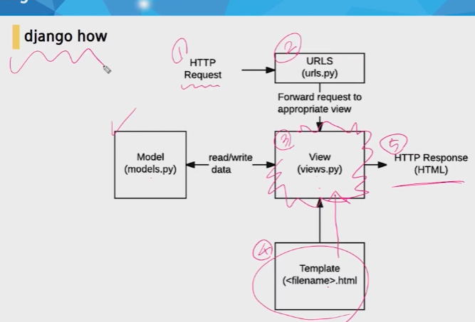
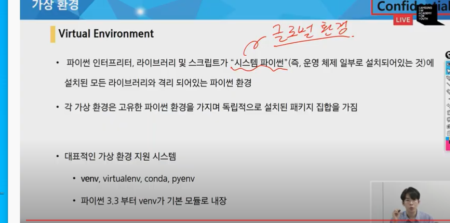
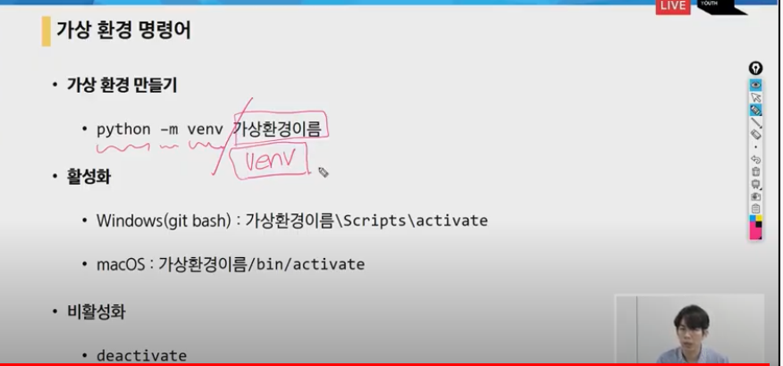

# Django = framwork

###  순서! 가장중요!!




```
1. 장고서버는 사용자의 요청이 들어와야 동작한다. (스스로 하지않음) 
 <요청은 http Request로 들어온다.>
2. Urls에서 정보를 확인한다.
3. view에서 urls에 있는 요청이 원하는 행동을 한다. (  >>main !!은 view << )
	views는 중간에서 동작하는 파이썬함수들이 적혀있는 공간이다.
	ex) 사용자가 원하는 것이 네이버의 메인페이지라면,view가 요청대로 temlpate에서 <네이버화면.html>를 가져온다.
4.>> 뷰가 템플릿에서 원하는 html을 가져온다.
5.사용자에게 응답을 한다..

만약 모델이 낀다면 뷰는 모델에서 데이터를 확인하고 템플릿과 함쳐서 응답을 해줄것이다.
```


### 프로젝트 작성방법

​	1.django-admin startproject ```first_django``` <프로젝트 생성방법>

​	2.cd, 또는 폴더에 들어가서 vs코드를 다시 실행시킨다.

3. python mange.py startapp ```articles!``` (변수이름이다.)

```
git bash에서도 가능하다.
django-admin startproject intro.

ls를 치면 manage.py가 만들어져있다.
python manage.py runserver로 확인
```


```
1. startproject
2. startapp   (앱을 생성을 먼저 한다. 초보자들이 하는 실수)
3. app 등록 - settings.py (installed_apps에 맨위에 articles 작성)
4. url www.binsan.com, www.binsan.com/login 달라야한다 그래서 url부터 정하고
   urls에 path 설정!  
   path('index/',views.index)
   - index란 주소창에 views.index란 파일을 불러와주겠다.
   >> www,localgost.com/index
   from articles import views 를 설정해서 불러와주어야한다.
5. view 동작
views.py에서 def index(request):
				return render(request, 'index.html')
6. template 어떤 모습으로?
    - 1.articles에 templates를 고정해서 만든다.
    - 2.index.html 에 !하고 hello django! 만든다!
    
    [최종]
    python manage.py runserver
    +control click
naver.com
-
```

time_zone = 'Asia/Seoul'

Language_code = ko-kr

```
사용자가 접근할 수 있도록 URL을 정의하고, VIEW함수로 연결한다.
View함수에서 어떠한 데이터를 가공하고, 사용자가 보는 브라우저 화면에 랜더링시킨다.
이때, 사용자가 조금더 예쁜 화면을 볼 수 있도록 Template에 담아서 보여준다

```


```
세팅
"files.associations": {
    "**/*.html": "html",
    "**/templates/**/*.html": "django-html",
    "**/templates/**/*": "django-txt",
    "**/requirements{/**,*}.{txt,in}": "pip-requirements"
},


"emmet.includeLanguages": {"django
```


# 1.request 


settings.py 반드시 알아야하고 모든 세팅을 관장한다.

```
서버끄는 법 control C!
서버 켜는 법 python mange.py runserver

```

```
프로젝트에서 앱의 이름은 복수형식으로 만들어준다.!! 
startapp articles

```

1. Project에서 settings.py 에 installed apps에 있는
   작성 순서


* django 특징은 마지막 배열에도 , 를 작성해준다.

주의사항!

>  앱을 생성한 후에 app을 등록해야한다

# 2.URL

> view를 보내기 전에 어떤 view함수를 호출할까
>
> 

  관리자 페이지 : http://127.0.0.1:8000/admin/login/?next=/admin/

1. articles app의 view.py의 함수를 작성할 

> from articles 패키지(init이 있기 때문) 앱의 views를 가져오겠다

> 현재는 views 에 파일이 없다. 따라서 앞으로 view를 작성해야한다!


# 3.  view.py 


> 함수간 간격은 항상 2줄이다!

> 반드시 뷰함수는 요청을 받기위해 첫번째 인자로 request를 받는다.


####  import에는 순서가 있다


> Url 에 articles라는 앱에 views를 가져올 것임을 명시할 것이다.

url 등록 완료!

# 3. template 

1. 템플릿은 *앱(articles)* 에 폴더를 만든다.
2. *반드시 articles라는 앱에 template`s`폴더를 만든다. 이때 이름 고정!* 이렇지 않으면 장고가 템플릿을 읽을 수 없다. 장고가 아는 경로가 아니기때문이다. 장고에는  장고가 알고있는 경로가 있다.
3. 만들어진 폴더안에 파일을 작성한다.
4. views 만든 작업
5. 


6. 사전을 호출한다.


>  {'pick'은 템플릿에서 사용할 pick이고, 우측 pick은 함수에서 사용하는 pcik} 

>  키값의 이름을 다르게하면 헷갈린다.

## 코드작성순서

> 데이터 흐름 <url>view>temeplates>대로

1. urls.py

2. views.py 

   ​		

   

3. templates


# 인사해주는 곳

127.0.0.1:8000/hello/harry

harry님 반갑습니다!

우리가 만들고 싶은 것은 바뀌는 것에 따라 이름을 넣어서 인사해주는 것


# Django Template Lanuage(DTL)

- django template system에서 사용하는 built-in template system이다.
- 조건,반복,치환,필터, 변수 등의 기능을 제공
- 프로그래밍적 로직이 아니라 프레젠테이션을 표현하기 위한 것.

syntax

variable = {{ }}

filter : {{variable|filter}}

tags: 


# 템플릿 시스템 설계 철학

- 장고는 템플릿 시스템이 표현을 제어하는 도구이자 표현에 관련된 로직일 뿐이라고 생각한다.
- 템블릿 시스템에서는 이러한 기본 목표를 넘어서는 기능을 지원한다.


[https://search.naver.com/search.naver?query=신민호)

겟에 딕셔너리로 입력을 받고있따..제일 중요!!


querydict는 딕셔너리

네임은 

겟방식 정리 !!

# 중요


```
query 스트림에는 키, value 방식으로 들어간다.

get // post 방식으로 들어간다.
```

get = 조회

post  = 변경


정보를 주고받고할 수 있는 방법

1. throw.html - form action 으로 보낸다.
2. /catch/ 요청을 보냄
3. catch view - data 
4. catch.html 


```
web 어떤 url로 요청이 오면 html css데이터로 만든 결과를 주는 로직.


```


form  - 어디에 정보를 보낼 때 사용

action -  정보를 보낼 장소

정보는 보낸다는 것은 해당 url에 정보를 담아서 요청을 한다.

서버는 해당 url로 보낸 정보를 받아서 처리해야한다.

GET (method) = 내가 보낸 정보가 적힌다.


1. url에 캐취를 만든다. path('throw', views.catch)

2. views에 와서 함수 설정

3. def throw(requests):

   return render(request, 'throw.html')

4.  templates에다가 throw.html 만듬  여기서 폼을 보여줌

5. form action="" method='get'

6. input type = "text" name = 'keyward'

7. form action="/catch/" method='get' 받을 곳으로보낸다

8. input type = 'submit' value = '검색하기'

throw는 완성


catch를 만들자

url >  path(''catch/'', views.catch)

views에서 def catch(request) 생성

keyword = request.GET.get('keyword')

GET= METHOD , 장고가 항상 대문자로 접근하도록 만들어 놓음

get = KEY 값받으려는 dict //

context = {

'keword' = keyword 

}

return render(request, 'catch.html',context)


articles에 catch.html을 만든다.


# 교수님

00_django_intro

2020.08.14


Intro

python version 3.7 확인
vscode django extension 설치 및 설정

설치
$ pip install django


특정 버전 설치
$ pip install django==2.1.15


설치 확인
$ pip list
# python -m django --version


프로젝트 생성

project 를 생성할 때, Python 이나 Django 에서 사용중인 이름은 피해야 한다.
- 도 사용할 수 없다. (ex. django, test, class, django-test...)

$ django-admin startproject first_project
서버 실행
$ python manage.py runserver
프로젝트 구조


__init__.py

빈 파일
Python에게 이 디렉토리를 하나의 Python 패키지로 다루도록 지시


settings.py

웹사이트의 모든 설정을 포함
우리가 만드는 어떤 application이라도 등록이 되는 곳이며, static files의 위치, database 세부 설정 등이 작성


urls.py

사이트의 url와 view의 연결을 지정


wsgi.py

Web Server Gateway Interface
장고 어플리케이션이 웹서버와 연결 및 소통하는 것을 도움


asgi.py

new in 3.0
Asynchronous Server Gateway Interface
장고 어플리케이션이 비동기식 웹 서버와 연결 및 소통하는 것을 도움


Application (app)

실제로 어떠한 역할을 해주는 친구가 app.
프로젝트는 이러한 어플리케이션의 집합이고, 실제 요청을 처리하고 페이지를 보여주고 하는 것들은 이 어플리케이션의 역할.
하나의 프로젝트는 여러 개의 app을 가질 수 있다.

app은 하나의 역할 및 기능 단위로 쪼개는 것이 일반적
그러나 작은 규모의 서비스에서는 잘 나누지 않는다.
반드시 이렇게 나눠야 한다 같은 기준 또한 없다.


일반적으로 app 이름은 복수형으로 하는 것이 좋다.

Application 생성
$ python manage.py startapp articles
Application 구조


admin.py

관리자용 페이지 관련 기능을 작성 하는 곳.


apps.py

앱의 정보가 있는 곳.
우리는 수정할 일이 없다.


models.py

앱에서 사용하는 Model(Database)를 정의하는 곳.


tests.py

테스트 코드를 작성하는 곳.


views.py

view가 정의 되는 곳.


Application 등록

반드시 app 생성 후 등록 순서를 지켜야한다.


방금 생성한 application을 사용하려면 장고 프로젝트에 등록을 해야 한다.
# settings.py

INSTALLED_APPS = [
		'articles',
    'django.contrib.admin',
    'django.contrib.auth',
    'django.contrib.contenttypes',
    'django.contrib.sessions',
    'django.contrib.messages',
    'django.contrib.staticfiles',
]


INSTALLED_APPS의 app order
INSTALLED_APPS = [
    # Local apps
    'blogs.apps.BlogsConfig',

    # Third party apps
    'haystack',
    
    # Django apps
    'django.contrib.admin',
    'django.contrib.auth',
    'django.contrib.contenttypes',
    'django.contrib.sessions',
    'django.contrib.sites',
]


Internationalization

https://docs.djangoproject.com/en/3.1/topics/i18n/

# settings.py

LANGUAGE_CODE = 'ko-kr'

TIME_ZONE = 'Asia/Seoul'
runserver Automatic reloading

개발 서버는 요청이 들어올 때마다(코드가 저장될 때 마다) 자동으로 Python 코드를 다시 불러온다.
코드의 변경사항을 반영하기 위해서 굳이 서버를 재가동 하지 않아도 된다.
그러나, 파일을 추가하는 등의 몇몇의 동작(커스텀 필터, 새로운 모듈 추가 등)은 개발 서버가 자동으로 인식하지 못하기 때문에, 이런 상황에서는 서버를 재가동 해야 적용되는 경우도 있다.


Url & Template
urls.py


장고 서버로 요청(request)이 들어오면, 그 요청이 어디로 가야하는지 인식하고 관련된 함수(view)로 넘겨준다.


views.py 에서 만든 함수를 연결시켜준다.
# first_project/urls.py

from django.contrib import admin
from django.urls import path
from articles import views

urlpatterns = [
    path('admin/', admin.site.urls),
    path('index/', views.index),
]


views.py
# articles/views.py

def index(request): # 첫번째 인자는 반드시 request
		return render(request, 'index.html') # render의 첫번째 인자도 반드시 request
Templates


views.py에서 지정한 index.html 파일을 만들자.


Django에서 template이라고 부르는 HTML 파일은 기본적으로 app 폴더안의 templates 폴더 안에 위치한다.
<!-- articles/templates/index.html -->

<h1>만나서 반갑습니다!</h1>


Template

https://docs.djangoproject.com/ko/3.1/topics/templates/#context


Template Variable


render()를 사용하여 views.py에서 정의한 변수를 template 파일로 넘겨 사용하는 것.


render()의 세번째 인자로 {'key': value} 와 같이 딕셔너리 형태로 넘겨주며, 여기서 정의한 key에 해당하는 문자열이 template에서 사용 가능한 변수명이 된다.
# articles/views.py

def dinner(request):
    menus = ['족발', '햄버거', '치킨', '초밥']
    pick = random.choice(menus)
    context = {
        'pick': pick,
    }
    return render(request, 'dinner.html', context)
<!-- articles/templates/dinner.html -->

<h1>오늘 저녁은 {{ pick }}!</h1>


django imports style guide

https://docs.djangoproject.com/en/3.1/internals/contributing/writing-code/coding-style/#imports

# standard library
import json

# third-party
import bcrypt

# Django
from django.http import Http404

# local Django
from .models import LogEntry

Variable Routing

주소 자체를 변수처럼 사용해서 동적으로 주소를 만드는 것
https://docs.djangoproject.com/en/3.1/topics/http/urls/#path-converters

# first_project/urls.py

urlpatterns = [
    ... ,
    # 혹은 path('hello/<name>/', views.hello),
    path('hello/<str:name>/', views.hello),
]

default 는 str 이기 때문에 생략 가능하다.

# articles/views.py

def hello(request, name):
    context = {
        'name': name,
    }
    return render(request, 'hello.html', context)
<!-- articles/templates/hello.html -->

<h1>안녕하세요, {{ name }}님!</h1>

Django Template Language

django template에서 사용하는 built-in template system이며,  조건, 반복, 변수 치환, 필터 등의 기능을 제공
프로그래밍적 로직이 아니라 프레젠테이션을 표현하기 위한 것
https://docs.djangoproject.com/ko/3.1/ref/templates/language/#tags
https://docs.djangoproject.com/ko/3.1/ref/templates/builtins/#built-in-template-tags-and-filters

syntax

variables

context에서 값을 출력하는데, context는 키를 값에 매핑하는 딕셔너리와 유사한 객체


tags
filters

변수 및 태그 인수의 값을 변환


comments


Form
Form

웹에서 사용자 정보를 입력하는 여러(text, button, checkbox, file, hidden, image, password, radio, reset, submit) 방식을 제공하고, 사용자로부터 할당된 데이터를 서버로 전송하는 역할을 담당하는 HTML 태그
form은 한 페이지에서 다른 페이지로 데이터를 전달하기 위해서 사용한다.
핵심 속성 2가지


action —> 입력 데이터가 전송될 URL 지정

method —> 입력 데이터 전달 방식 지정


Input

form 태그 중에서 가장 중요한 태그로 사용자로부터 데이터를 입력 받기 위해 사용된다.
input 태그의 속성


name

중복 가능, form을 제출했을 때 name이라는 이름에 설정된 값을 넘겨서 값을 가져올 수 있다.
주요 용도는 GET/POST 방식으로 서버에 전달하는 파라미터(name 은 key , value 는 value)로 ?key=value&key=value 형태로 전달된다.


HTTP method GET

https://developer.mozilla.org/ko/docs/Web/HTTP/Methods


서버로부터 정보를 조회하는 데 사용한다.
데이터를 서버로 전송할 때 body가 아닌 쿼리 스트링을 통해 전송한다. (url에서 확인 가능)

서버의 데이터나 상태를 변경 시키지 않아야 하기 때문에 조회(html)를 할 때 사용한다.
우리는 서버에 요청을 하면 HTML 문서 파일 한 장을 받는데 이때 사용하는 요청의 방식이 GET 방식이다.

throw & catch


throw
# first_project/urls.py

path('throw/', views.throw),
# articles/views.py 

def throw(request):
    return render(request, 'throw.html')
<!-- articles/templates/throw.html -->

<form action="/catch/" method="GET">
  <label for="message">Throw</label>
  <input type="text" id="message" name="message">
  <input type="submit">
</form>


catch
# first_project/urls.py

path('catch/', views.catch),
# articles/views.py

def catch(request):
    message = request.GET.get('message')
    context = {
        'message': message,
    }
    return render(request, 'catch.html', context)
<!-- articles/templates/catch.html -->

<h1>너가 던져서 내가 받은건 {{ message }}야!</h1>
<a href="/throw/">뒤로</a>


Request

https://docs.djangoproject.com/en/3.1/ref/request-response/#module-django.http

요청 간의 모든 정보를 담고 있는 변수
페이지가 요청되면 Django는 요청에 대한 메타 데이터를 포함하는 HttpRequest 객체를 만든다.
그런 다음 Django는 적절한 view 함수를 로드하고 HttpRequest를 뷰 함수의 첫 번째 인수로 전달합니다.
그리고 각 view는 HttpResponse 개체를 반환한다.

# --------------------------------------------

# 0818 송교수님 django 강의

1. lorem 조정

2. truncatewrods : 글자수를 제한할 수있다. 대신 끝에는 ...이 포함된다!
3. 글자관련 필터
4. 연산이 가능하네
5.  include로 앱별로 구별가능 (urls.py를 만들 때 urlpatterns를 만들어줘야한다.)
6. 같은 templates가 있을 경우 장고는 모든 파일들을 하나로 모아서 관리하기 때문에,
7. installed에 등록된 순서에 따라 찾고 넘어간다.
8. 이를 구분하기 위해 각각 templates에 폴더를 만들고 인덱스 , html 을 만들어서 접근을 하게만들어서 구분을했다.
9. base.html은 모든페이지에 동일하게 들어갈 녀석들은 미리 만들어 ㄶ고 블록을 통해서 세부내용용을 채울수 있다. 사용할 때는 코드 최상단에 extends base.html을 똑같이 작성을 하고
10. 각 블록에 들어갈 내용을 작성을 하면 된다. 그리고  setting.py에다가 dir에 추가를 하면 사용가능하다.
11. 이게 없으면 templates에 폴더가 뜨지않는다.
12. catch

##### include를 통해 앱을 구분하는 것

##### base.html 을 사용해서 세부내용 채우는 것


네임을 설정하는 이유 :

 URL에 접근할 때 용이하기 위해?


```
code intro/ vs코드를 들어가서 자동으로 열 수 있다.
```


name을 하는 이유는  url 경로를 간편화하기위해서! 한다.

---

## Django 02


# 모델이 하는 일


- 장고는 모델을 통해서 데이터에 접속하고 관리한다.

  MODEL 과 DATABASE는 정확하게 이야기하면 다르다.

  모델이 Database를 관리를 한다.

  


##### 데이타의 기본 구조 

> 스키마와 테이블! (엑셀시트라고 생각하자)


> DB가 여러테이블을 담고있다.


> 테이블은 열과행으로 이루어짐


> 널은 값이없음
>
> 열 == 필드


> 행은 레코드
>
> 4개의 레코드가 존재한다. id.name은 미포함


>  PK 는 1234를 말하고 기본키라 이야기한다. 반드시 있어야 한다 왜냐하면 접근하기 요이하고 이름이 중복된 경우 2개의 데이터가 나오기 때문에 정확성이 떨어진다.
>
>  그래서 각 레코드에는 고유값인 Primary Key를 사용한다.


> 데이터베이스의 구성!

### Model

- 어떻게 작성할 것인가?
- 어떻게 저 데이터베이스를 조작할 것인가?


#### ORM


> 객체 지향 프로그래밍 언어
>
> DB - SQL
>
> DJango - Python 으로 조작
>
> DJango가 DB 조작
>
> Python으로 SQL를 사용하기 위해 필요한 것이 ORM이다.
>
> 


>  ORM의 동작 모습을 가시화.
>
>  우리는 ORM 덕분에 PYTHON으로만 조작하면 된다
>
>  SQL부분은 ORM이 모두 관리함.

- 모델에서는 클래스를 중심으로 사용할 것이다.


> ORM 장점
>
> 속도는 빠르나 , 디버깅이 어렵고 유지보수가 어렵다.
>
> ORM을 쓰는 이유는 생산성!
>
> 우리는 DB를 객체로 조작하기 위해서 ORM을 사용한다.

  


> 깃베쉬에서 빠르게 생성가능하다.


#### 실습!

앱 생성과 등록을 한후

모델에서 class 를 생성한다.

이름은 앱이름의 단수형으로 작성한다!


> 이 하는 일은 


> 이곳에서 확인 가능하다.
>
> 우리는 상속을 받아서 편하게 작성중이다.


> 대표적으로 사용하는 함수들이다.  암기 필수!!

## 중간 정리!

- charField(max_length=None)

  - 길이의 제한이 있는 문자열을 넣을 때 사용
  - max_length가 필수인자
  - 필드의 최대 길이, 데이텅베이스와 django의 유효성검사에서 사용
  - input type text라는 값으로 출력

- TextField()

  - 글자의 수가 많을 때 사용

  - <textarea> 

- DateTimeField()

  - 최초 생성일자 : auto_now_add = True
    - django ORM이 최초 데이터 입력시에만 현재 날짜와 시간으로 갱신
    - 테이블에 어떤 데이터를 최초로 넣을 때
  - 최종 수정일자 :  auto_now = True
    - django ORM이 save를 할 때마다 현재 날짜와 시간으로 갱신

  ---

  ### Migrations

  - makemigrations
  - 모델을 활성화하기전에 db설계도를 작성
  - 생성된 마이그레이션 파일은 데이터베이스 스키마를 위한 버전관리 시스템이라고 생각.

  

  #### migrate

  - 작성된 마이그레이션 파일들을 기반으로 실제 DB에 반영
  - db. sqlite3라는 데이터베이스 파일에 테이블을 생성하는 작업
  - 모델에서의 변경 사항들과 DB의 스키마가 동기화를 이룸

  

  #### sqlmigrate

  - 해당 마이그레이션 파일이 SQL문으로 어떻게 해석되어서 동작할지 미리 확인하기위한 명령어

  

  #### showmigrations

  - 마이그레이션 파일들의 migrate 여부를 확인하기 명령어

  ## Model 의 중요 3단계

  1. models.py : 변경사항 발생
  2. makemigrations : 마이그레이션 (설계도) 만들기
  3. migrate : DB에 적용

  

  


#### 오늘의 가장 중요한 핵심 : Migrations

>  모델에 생긴 변화를 데이터베이스에 반영하는 방법.


> makemigraions는 마이그레션을만들때 사용한다는 것에서 마이그레이션이 설계도를 뜻한다.

>  migrate

- 마이그레이션을 DB에 반영하기 위해 사용에서는 테이블을 생성한다는 것을 알아야한다.

> 위에 두가지  명령어는 반드시 알아야한다.


> 입력하면


> 자동으로 생성이된다.

이부분 복습이 필요하다.


번역된 sql을확인하기 위해선


> 이 명령어를 사용한다.


> db위치.

##### 모델에 변경사항을 줘보자

마이그레이션은 모델의 변경사항을 반영한다!!

한번 모델에 변경사항을 줘보자

모델에수정사항이 생겼다면

python manage,py makemigrations를 작성해준다!


결과는


> 새로운 migration가 만들어진다. 점점 쌓아나가진다.

# migrate


> 입력을 하면 db.sqlite3가 만들어진다.


# DB API


> dB를 편하게 조작할수 있도록 도와준다


> all 이란 것은 API 
>
> 장고에 있는 기능이 아니다
>
> 이를 사용하기 위해 Django 클래스에 objects라는 Manager를 추가해서 사용한다.
>
> Quearyset
>
> 데이터 베이스로부터 전달받은 객체 목록인데
>
> 목록안에는 데이터가 없을 수도 있지만 데이터타입은 Queryset이다


---

송교수님


---

# 0819 오후 강의

1.ipython 설치함

2.django -extension 설치함

3.installed_app에 등록을 시키고나서

`

4. 임포트를 받는다.
5. 


> QuerySet 안에있는 []를 []로 활용할 수 있다. 슬라이싱 가능!


###	CRUD


>  크루드는 db api로 조작을해보겠다.

#### 1번 방법


1. 인스턴스 생성! 


2. 인스턴스로 클래스 변수 접근해 해당 인스턴스 변수 변경
3. save()


> 인스턴스로 세이브를 하면 object 의 None값이 (1)로 만들어진다.

- 결과는 데이터베이스  db.sqlite3에 실제로 작성을 한 것이 된다.


여기까지 데이터를 작성하는 첫번째 방법!이었다.

> 확인방법
>
> pk 와 id는 동일하다!
>
> 장고에서는 pk를 사용해서 id를 확인한다.
>
> 

---

##### CREATE

데이터를 작성하는 3가지방법

###### 1 방법

번쨰

1. article = Article() : 모델 클래스로부터 인스턴스 생성
2. article 인스턴스로 클래스 변수에 접근해 해당 인스턴스 변수를 변경(article.title = 'first')
3. article.save() 메서드 호출> db에 실제로 저장이 끝


##### 2 방법

1. 클래스로 인스턴스 생성 시 keword인자를 함께 작성
2. article = Article(titme = 'second', content = 'django!')
3. article.save()메서드 호출


###### 3방법

1. create() 메서드를 사용하면 쿼리셋 객체를 생성하고 save하는 로직이 한번의 step으로 가능


>   save를 하지않아도 된다.


최종확인


___

## READ

- all()
  - QuerySet return
  - 리스트는 아니지만 리스트와 거의 비슷하게 동작(조작할 수 있음.
- get()
  - 객체가 없으면 DoesnotExist에러가 발생
  - 객체가 여러개일 경우는 'MultipleObjectRetrurned' 에러가 발생
  - 위와 같은 특징을 가지고 있기 때문에 unique 혹은 Not Null특징을 가지고 있으면 사용할 수 있다.(예는 pk)
- filter()
  - 지정된 조회 매개 변수와 일치하는객체를 포함하는 QuerySet을 return

---

##  Update (어려움)

1. 몇 번 글 수정? .get()


## delete


> 1번을 딜리트하면 다음에 적는 글은 1번에 올까 4번에 올까?


> 정답은 4번이다. 이유는 삭제를 했기 때문에, 데이터베이스에서는 불필요하다고 판단한다. 따라서 재사용하지않는다!

#### 여기까지가 DB API를 통해서 CRUD를 작성을 했다.


## 관리자 계정 만들기


> 이것이 가능한 이유는 __str__을 설정했기 때문이고, 원래는 object로 표현이된다.

앞으로 views.py에서 CRUD를 입력할 것이다.!


## --- 0820

페이지만들기


view 작성

커뮤니티 게시판


Article shell_plus CRUD

csrf tokken 크로스 사이트 요청 위조


무슨일이 일어날까?

정당한 토큰 없이 요청을 하면 403

정당한 토큰을 요청하면 정당한 토큰이다/아니다


정당한 토큰을 받으려면?

/new/페이지로 들어와서 글을 써야만 토큰을 받을 수 있는 것이다.

포스트 는 csrf를 필요로 한다.


GET / POST

GET - 요청을 아무리 여러번 해도 DB에 변화가 없는 요청 -검색,조회

a태그 겟방식의 요청이다.

POST - 요청 할때마다 DB에 변화가 일어나는 요청 - 글쓰기, 수정, 삭제

form get, post 둘다 가능 , method를 설정할 수 있다.

아무나 db에 변경할 수 없도록 보안장치 - csrf token


```
client >> server
server는 url을 
include 는 urls.py 로 요청을 올린다. 
articles url에서 sub는 url에서 파악한다.

템플릿과 정보 혼합을 해서 보내는 것이 render가 된다.

```

모델 > 마이그레이트


실제 데이터에 접근하고 싶다면Articles. objects.order.by


# ---------------------------------------------

# 0821

 

CRUD는 계속 해서 작성을 해줘야한다. 반복!

안보고도 짤 수 있을때까지..!


## 오늘의 주제 : 가상환경



우리는 venv를 사용할 것이다. 기본 모듈로 정해졌기 때문에.

파이썬 공식문서에서도 venv를 사용하는 것을 권장하고있다.

우리가 만약 장고를 한번 설치하면 글로벌 환경에서 설치되기 때문에 모든 곳에서 같은 버전을 사용할 수있었다.

가상환경을 만들고 수업을 진행하게 될것이다.

1. 가상화면 만들기!



python - m venv 가상환경이름!

가상환경이름에 scripts라는 폴더에 activate를 실행시켜야한다.

끄는 경우는 deactivate를 입력한다.

