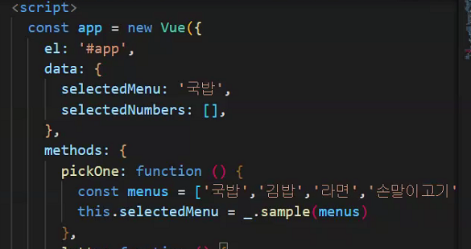
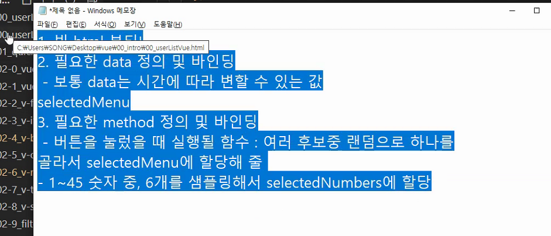

202011-9

---

# VUE

intro


```
서버 : 뭔가를 제공하는 컴퓨터 - django, html , json, data
```


프론트프레임워크 (vue)를 만들었다 왜?

좀더 쉽게 html 페이지(css,js)를 만들기 위해서


> v- if 와 show 의 차이
>
> 랜더링이 되냐 안드냐의 차이
>
> if 는 렌더링이 안됨
>
> show는 렌더링이 되나 display none!





내일 복습할 것!

내일 나는 인터뷰도 하구

근영이랑 밥먹는다

내일 하기위해 복습잘하자

질문도 하고~