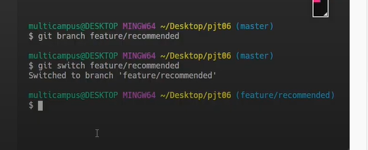

>  git upload시 brunch의 참고할 커밋이름이다.

> git branch branch 생성 확인

>  이동!

> 두번째 사람 푸터 수정가

> 수정 완료 후  커밋!

gitlab flow 검색 `https://docs.gitlab.com/ee/topics/gitlab_flow.html`

github flow 검색 `https://guides.github.com/introduction/flow/`

PR 완료해주세요~ 개발자로 회사에서 생활시 많이 쓰인다.

> frature/nav가 브런치로 추가가된다.
>
> footer도 하면 동일한 내용 확인!

마스터로 정보 이동완료 후

다시 가져올 때는 다음과 같다.

git pull origin master로 최신화를 한 후

git branch -d feature/nav

지워준다.

 그러면 master만 남게된다

commit 확인

3. 충돌이 일어날 경우!

> 두개의 브런치가 동일한 부분을 수정할 경우 충돌이 일어난다.

충돌이 일어나면 

기본이 되는 코드와 내가 합치려는 코드랑 비교해야한다.

웹사이트상에서도 가능하다.!

포크를 한다

fork해서 각자의 레포로 이동시키다

clone을 해서 로컬로 저장

바로 코드수정이 아니고 branch 생성을 한다. 이름은 dj2/shinminho

코드 수정 후 에드 커밋 푸쉬 실시

ㄱ러면 나의 레포에 업뎃이된다.

mr 리퀘스트를 보낸다 ssafyy4/essay-contest를 한다.

다음 머지리퀘스트

하면 끝

꼭 하고

브랜취 생성 잊지말자

추천 알고리즘을 만들어주고싶

필터를 이용하여 데이ㅌ

