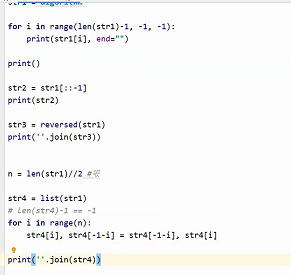
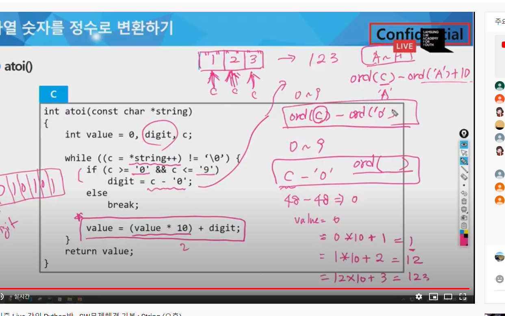
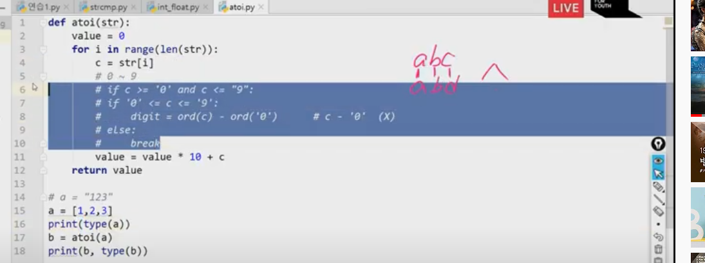
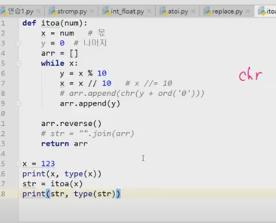
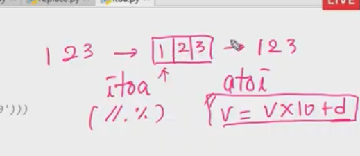
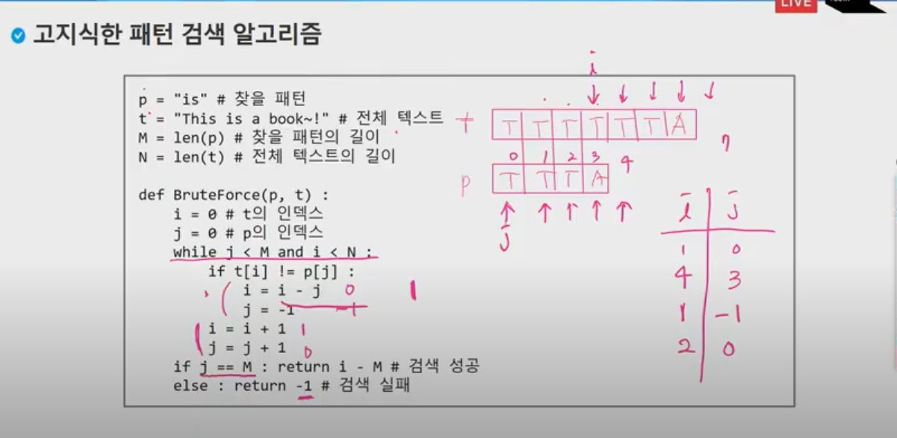
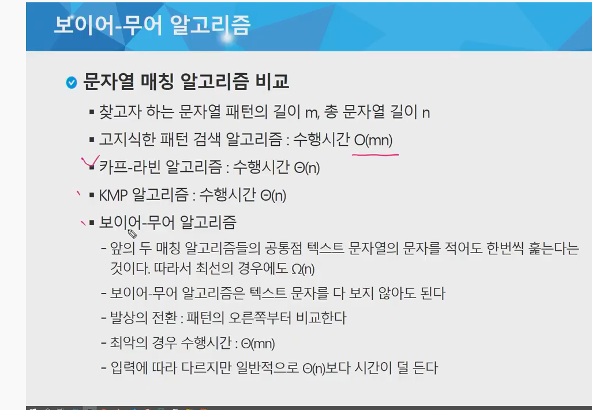
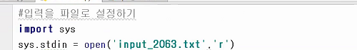
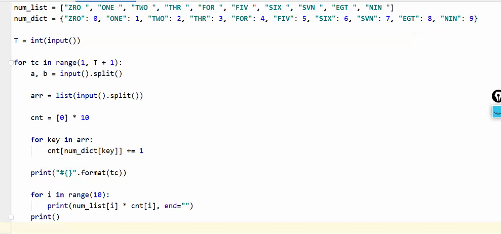

# 알고리즘!  

> 2020 0824


- 패턴매칭은 blue to force이다.. 이게 뭔가..? 이것부터 알아야한다.
  - 컴퓨터의 힘을 쓴다는 뜻
  - kmp
  - 보이어-무어
- 문자열 표현!
  - 메모리에는 숫자를 저장한다.

### ASC

 **ASKII  7 bit 인코딩**으로 128문자(0~127)를 표현하며 33개의 출력 불가능한```/0 null```문자 제어 문자들과 공백을 비롯한 95개의 출력가능한 문자들로 이루어져있다.

Byte의 정의?  

> 영문자 한자를 나타내는 단위다.
>
> 100byte 영어단어 100자가 저장된 것이구나.

parity bit(짝수,홀수)  = 에러를 체크할 수 있다.

0001000  > 1의 개수를 짝수로 만들자  그러기 위해선 1을 더한다. 

00010101 이 오면 짝수개가 아닌 것을 판단하기위해 페리티 비트를 사용한다.


 ### 아스키코드


> 외우면 좋은 것
>
> A = 65
>
> a = 97 
>
> 대문자 소문자 변환 시 32만큼의 변화가 있다는 것을 알아야한다.
>
> 0은 48번
>
> 32번 앞에는 출력되지않는 것들이다.

---


유니코드!!를 다시 character Set으로 분류한다.

utf (UTF - UNICODE TRANSFORMATION FORMat) - 8 1,2,3,4비트를 각각 사용할 수 있다. 한글은 3비트!

파이썬은 utf-8 이다.

자바는 utf-16이다.

---

python 은 char 타입이 없음 . string으로 처리를 함

보통 c에서는 문자 'A' , "ABC" 로 구분하지만 python에선s 'abc' 나 ABC'나 동일하다.그래서 더할 수도 있도 있고 ''' /''' 연결도 가능하다 . *3 을 하면 반복도 된다!

### 문자열 뒤집기


- 알고리즘


4번을 돌리면 된다. 알고리즘이 문자열인데 바꾸기가 될까?

절대 안된다!! 리스트함수를 사용해서 리스트로 바꿔서 적용해야한다.

str이 아닌 arr을 가지고 해야한다.

다 끝나고 "".join(arr)을 해주면 문자열로 바뀌게 된다.

str > list

swap

list> str로 바꾼다.


```python
sentence = 'algorithm'
result = ''
print(sentence)
sentence=list(sentence)
print(sentence)
sentence[0],sentence[8] = sentence[8],sentence[0]
sentence[1],sentence[7] = sentence[7],sentence[1]
sentence[2],sentence[6] = sentence[6],sentence[2]
sentence[3],sentence[5] = sentence[5],sentence[3]
sentence=''.join(sentence)
print(sentence)
```

```python
def str_rev(str):
    arr = list(str)
    for i in range(len(arr)//2):
        arr[i],arr[len(arr)-1-i] = arr[len(arr)-1-i], arr[i]
    str = ''.join(arr)
    return str
    # ----------------
str = "algorithm"
str1 = str_rev(str)
print(str1)
```

```python
s = "algorithm"
s = s[::-1]
print(s)
```

```
양명균교수님버전
```



오후 수업


```
test = '1+2'
print(test) 
print(repr(test)) 문자열 표시를 해준다.
print(eval(repr(test)))  eval은 벗겨준다!
print(eval(eval(repr(test))))
```

```
결과
1+2
'1+2'
1+2
3
```



필요한 순간이 올것이다..

16진수를 10진수로 바꿀 떄는 ord (c) - ord [a] + 10


문자열도 비교가 가능하다.

abc <abd  로 나온다 아스키 코드 덕분이다!

```python
def atoi(str):
    value = 0
    for i in range(len(str)):
        c = str[i]
        # # 0~ 9
        # if c >= '0'and c <= '9':
        if '0' <= c <= '9':
            digit = ord(c) - ord('0')
        else:
            break
        value = value*10 +digit
        return value

a= '123'
# a= [1,2,3]
print(type(a))
b = atoi(a)
print(type(b))
```


리스트!



여기부분 헷갈렸다!!

```python
def itoa(num):
    x = num # 몫
    arr = []
    y = 0 # 나머지
    while x:
        y = x % 10
        x = x // 10
        arr.append(chr(y + ord('0'))) # 문자열을 만들려고!
    arr.reverse()
    str = "".join(arr)
    return str

x= 123
print(x,type(x))
str = itoa(x)
print(str,type(str))


```



 둘의 차이가멀까

---

# 오늘의 핵심



---

고지식한 방법..

잘 모르겠군 

이제 보니 알았다!! 



 

역시 모르겠군..




아는것!

양명균 교수님 

---

== 과 is의 차이

a= [1,2,3]

b = a

c = [1,2,3]

파이썬 ==  값을 비교하는 것이다.

is 는 주소값이 같은지 확인

print(a is b) true

print(a is c ) false  (id가 다르기 때문에, 서로 다른 객체이다.)

---


알고리즘

- 고지식한 패턴 검색 알고리즘 ```okey!```
- 카프-라빈 알고리즘```x```
- KMP 알고리즘```x```
- 보이어-무어 알고리즘```x```

> 고지식한  패턴 검색 알고리즘만 알겠따 ㅎㅎ 0825


노연관 __

보충 때 입력텍스트 받아오는 방법임.




오늘 현우랑 공부할 것.

1. 완전탐색  ㅁ 

2. 사전으로 풀어보기.ㅁ 

   - 사전으로 숫자들이 몇개인지 기입하는 논리

   - 흐름

     - dictionary 선언  bin[i] = bin.get(i,0)=1 을 하면 내가 원하는 사진에 값의 개수 를 부여할 수 있었다.
     - for문을  words 다돌리기
     - 요소를 키값에 넣고 중복된 키값의 개수를 count
     - 0부터 개수만큼 나열

     

     현우 스터디 강조사항 ㅁ 

     > 제목은 영어!  파일위치확인에 문제가 발생할 수 있다.
     
     


# 알고리즘 

> 0825  = 오늘은 하루종일 숫자나열, 고지식한 패턴분석, 회순1,2 문제 풀었다..



>  GNS 문제 풀이 

파이참 단축키

```
시프트 엔터 내려감

컨트롤 d 복사

alt + shift 방향키 = 움직임

control + y 잘라냄

자동들여쓰끼 = control art + l


- 회문 2개
- 
```

- sort()와 sorted의 차이

  > 원본을 수정하느냐 마느냐의 차이이다.
  >
  > sort()가 원본을 수정하고 sorted는 원본을 수정하지않고 정렬만 해준다.

---

> 20200824일에 고지식한 패턴 검사를 배웠다면
>
> 20200825일은 벽만드는 법을 배우겠다.

- 벽만드는 것

```
T = int(input())                                    # tc개수

def pal_check(line):                                # 회문 체크 수업시간함수
    for idx in range(len(line) // 2):
        if line[idx] != line[-idx - 1]:
            return False
    return True

for tc in range(1, T + 1):
    N, M = map(int, input().split())
    found = False                                   # 루프 깨줄 변수
    arr = [list(input()) for _ in range(N)]
    print('#{}'.format(tc), end = " ")
    for i in range(N):
        for j in range(N - M + 1):
            sample = arr[i][j:j + M]                # 가로
            sample2 = [a[i] for a in arr[j:j + M]]  # 세로
            if pal_check(sample):                   # 가로에서 회문 찾을 경우
                print(''.join(sample))              # 하나로 합쳐주기
                found = True                        # 찾았다
                break
            elif pal_check(sample2):                # 세로에서 회문 찾을 경우
                found = True                        # 찾았다
                print(''.join(sample2))
        if found:                                   # 회문 1개뿐이므로 찾았으면 루프 깨주기
            break

```

```python
GNS
num_list = ["ZRO ", "ONE ", "TWO ", "THR ", "FOR ", "FIV ", "SIX ", "SVN ", "EGT ", "NIN "]
num_dict = {"ZRO": 0, "ONE": 1, "TWO": 2, "THR": 3, "FOR": 4, "FIV": 5, "SIX": 6, "SVN": 7, "EGT": 8, "NIN": 9}

T = int(input())

for tc in range(1, T + 1):
    a, b = input().split()

    arr = list(input().split())

    cnt = [0] * 10

    for key in arr:
        cnt[num_dict[key]] += 1

    print("#{}".format(tc))

    for i in range(10):
        print(num_list[i] * cnt[i], end="")
    print()
```

```python
행렬찾기

#행렬의 사이즈를 찾는 함수
def search_size(r, c):
    r_cnt = 0
    c_cnt = 0

    for i in range(r, N + 2):
        if arr[i][c] == 0:
            break
        r_cnt += 1
    for j in range(c, N + 2):
        if arr[r][j] == 0:
            break
        c_cnt += 1

    ans.append([r_cnt, c_cnt])

    init(r, c, r_cnt, c_cnt)

#구한 행렬을 0으로 초기화 시키는것
def init(r, c, r_cnt, c_cnt):
    for i in range(r, r + r_cnt):
        for j in range(c, c + c_cnt):
            arr[i][j] = 0


T = int(input())

for tc in range(1, T + 1):

    N = int(input())

    #전체적인 띠를 두르는 작업
    arr = [0] * (N + 2)
    arr[0] = arr[N + 1] = [0] * (N + 2)

    for i in range(N):
        arr[i + 1] = [0] + list(map(int, input().split())) + [0]

    ans = []

    for i in range(1, N + 2):
        for j in range(1, N + 2):
            if arr[i][j] != 0:
                search_size(i, j)

    #정렬, 행렬크기 기준, 같다면 행크기 기준
    ans = sorted(ans, key=lambda x: ((x[0] * x[1]), x[0]))

    print("#{} {}".format(tc, len(ans)), end=" ")
    for i in range(len(ans)):
        print("{} {}".format(ans[i][0], ans[i][1]), end=" ")

    print()
```

