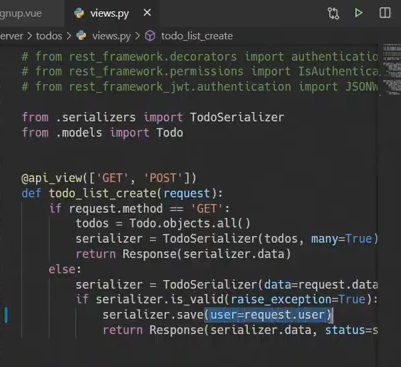

# 2020-11-16

>  서버는 클라이언트에게 네트워크를 통해 정보나 서비스를 제공하는 컴퓨터 시스템!

****

>  클라이언트는 네트워크를 통하여 서버라는 다른 컴퓨터 시스템 상의 원격 서비스에 접속 할 수 있는 응용프로그램이나 서비스를 말한다. 서버에서 그 서버가 맞는 서비스를 요청하고 서비스 요청을 위해 필요한 인자를 서버가 원하는 방식에 맞게 제공하며, 서버로부터 반환되는 응답에 사용자에게 적절한 방식으로 표현하는 기능을 가진 프로그램이나 시스템이다. 

server - 정보요청

client 정보 요청과 표현

제이슨 응답!

serializer = 직렬화!

> 기획부서가 하는일

디자인 > 기능개발 > 추가디자인 > 

개발 시에는 프론트/ 백엔드 

처음에는 API 문서를 만든다.

> 회사에서 사용하는 front와 backend의 방식

API 문서를 만들기위해서는 기능에 따라 요청과 응답 방식을 정해야한다.

front/back 개발하고 합쳐야한다.

---

오후

인증 폼을 만들자

> 인증폼

>  crendentials안에 데이터를 양방향으로 넣어서 서버로 보낼 것이다

> 보통 확인을 누르고 엔터를 치니까

입력 받고

확인

이제 이 데이터를 서버로 날려주면 된다.

서버는 얘를 받아서 처리를 하면 된다.

회원이 투부를 쓸 수 있게 만들어야한다

따라서 하나의 유저는 여러개의 todo를 가질 수있게 만들어야한다.

1:N 관계를 만들어야한다.

먼저 user모델을 만들자

accounts의 모델로 가서

user custom model

커스텀을 실시하자.

accounts에 model에 작성

다음은 장고는 이 모델을 커스텀한걸모르기 대무네 setting.py에

AUTH_USER_MODEL = 'accounts.USER'

migration를 지운다 숫자만 적혀있는 것들만!

db도 같이 날리고 migrate를 다시하기전에

1:N으로 만들어줘야한다

todo models.py에

from django.conf import settings

user = models.ForeignKey(settings.AUTH_USER_MODEL, on delete = models.CASCADE)

역참조 시

related_name = 'todos'

related_name하면 user.todos로 역참조가 가능해진다.

이후 makemigrations 와 migrate 를 통해 실시

drf_accounts_serializers

password를 그냥 직렬화해서 보내는 것은 안됨

password에 설정을 하자

password = serializers.CharField(write_only=True) 쓰기전용!

서버를 켜고

settings에서 url 연결 후

accounts에 urls

> accounts.views.py
>
> 

test 지워줌

서버로 보내줌!

응답확인

라우터 아직만들진않았지만 라우터 추가

회원가입이 된거다!

이제 로그인하러가자

django restramework jwt 참고

입력

accounts urls.py에 

토큰을 알아서 받는다

유효기간 연장

server의 settings.py에 

token을 받는다

jwt.io를 검색한다

코딩을 디코딩을 해준다.

다음

signup 템플릿 코드를 login에 복붙 후 이름 변경~

모르게써 ~~

잘 저장은 됐어.. 로그인은 됌....

app.vue에서 로그인하면 보여주고 getItem은 저장한 이름을 가져오는거

, 달자

그럼 반영이됨..

근데 새로고침을 해야 반영이됨.

해결을 위해

emit login!

그럼 바로 바뀐다!

이제 로그아웃을 만들차례

app.vue에 토큰을 날려버리면 된다.

로그아웃 메서드 수행방법

 a 태그가 맞지만 , 잘 바뀌지않는다.

native속성을 추가한다.

로그아웃완료

로그인, 로그아웃 완료

인증 확인jwt 확인 해줌

인증된 사용자인지, 올바른 jwt인지 확인해줌

그럼 데이터가 써짐..

> user에 맞게 역참조실시.

내글이 아닌데도 수정이 됨

그걸 막아주기 위해

몰라아

create 날릴 때 토큰이 없다..

Todolist에 넣고 

