Vuex

담은 헬로 지우기!

이렇게 만들거임

> dev tools

인덱스의 todo를 가져왔다.

 

 

 

Todoform 실행할 수있는 방법?

귀를 열고 press에 엔터를

잘 호출되는지 확인~

> todotitle을 만든다.

> 양방향으로 값이 입력되게 한다.

state변경 은 어디서하나

mutations에서 하지

mutations는 항상 대문자!

뮤테이션 작성후 이제 뮤테이션을 불러보자

방법은??

 

확인결과 이렇게뜨네 

여기서 이제

commit과 

 

index.js에 todo로 파일을 저장시키고싶다.

여기에!

> todo item을 추가

state에 값을 넣어서 보내보자

들어감

이제 초기화가 하고싶다.

todotitle 추가

actions를 활용해서 mutations 바꿔보자

주석처리~하면

dispatch를 통해서 actions를 부른다.

actions를 뭐를 통해서 뭐가 넘어온다?

mutations 는 state를 변경하는 친구다 state를 넘어오라한다.

actions는 context

context확인

잘들어가진다

정보를 보낼 때  key

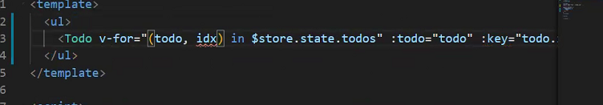

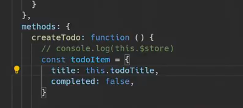

---

오후 수업

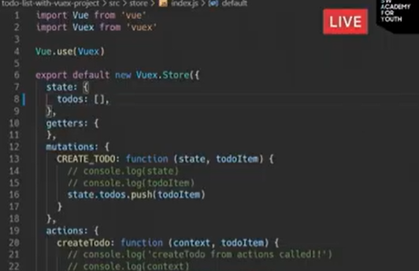

todos를 빈배열로 만듬

빈 배열이 입력되어도 검색이 안되게 만들자

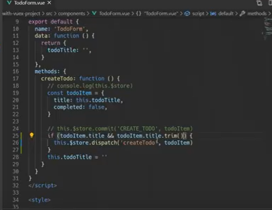

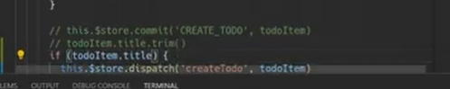

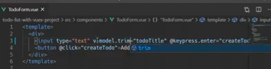

 

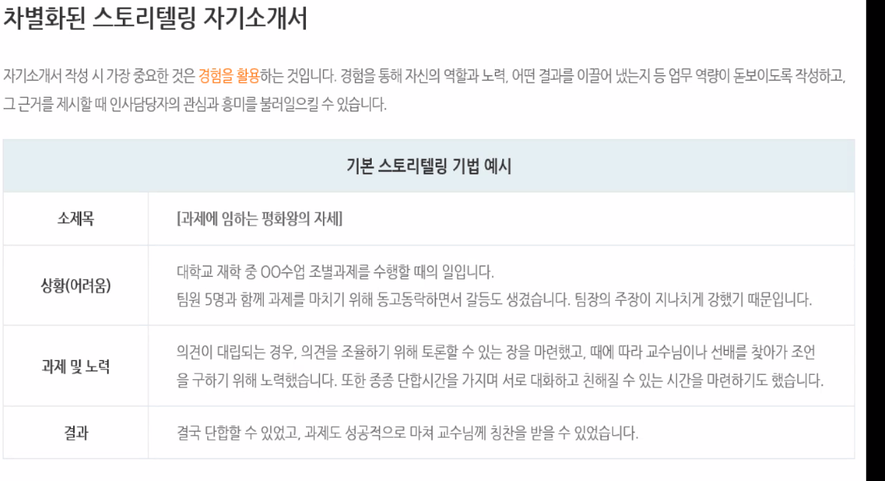

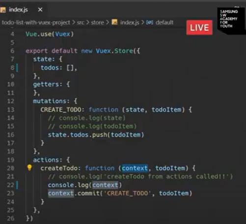

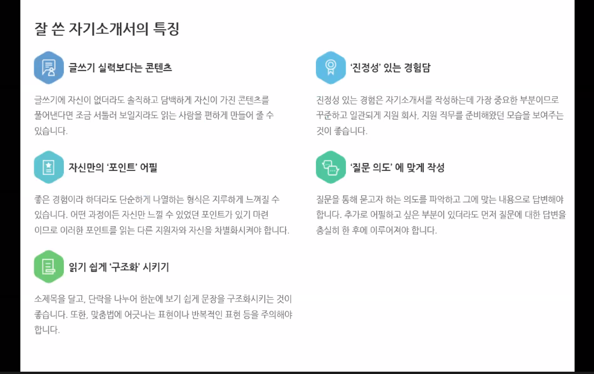

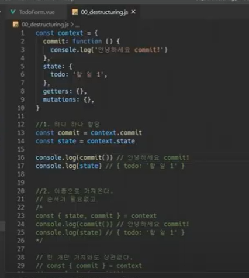

> 서버끄고00_ destucture로 이동

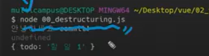

 

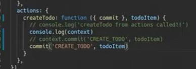

desturcturing을 활용!

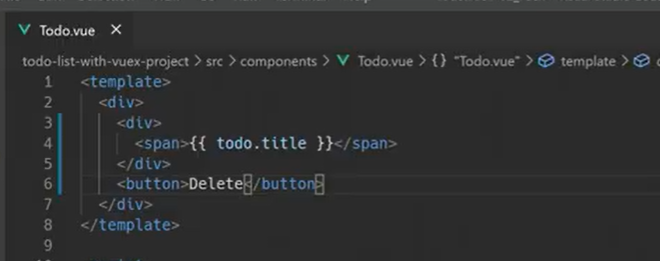

삭제만들자

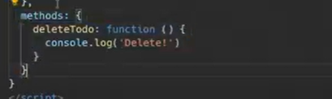

버튼을눌렀을 때 호출하게하자

듣고

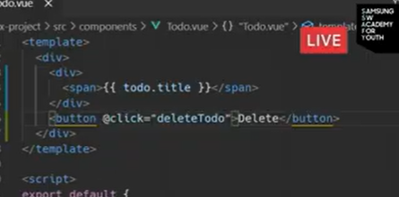

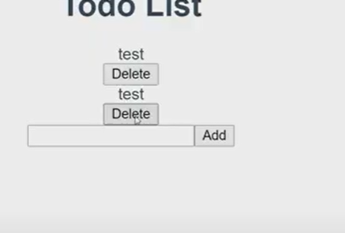

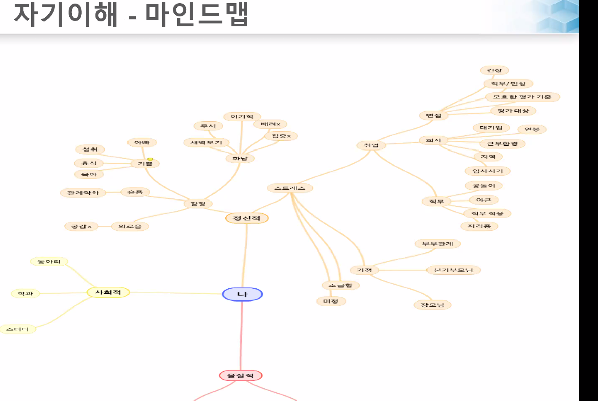

 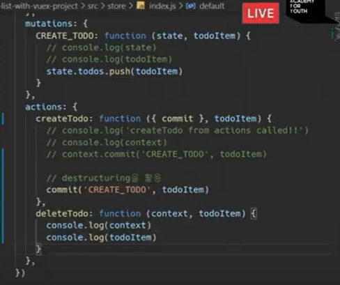

내용확인  

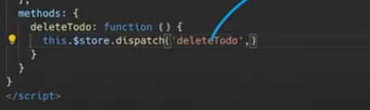

Todo.vue에서 디스페치로 actions를 부르자

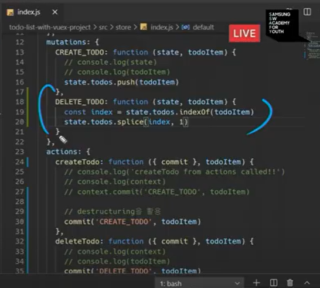

 delete완료

이제 update를 해보자

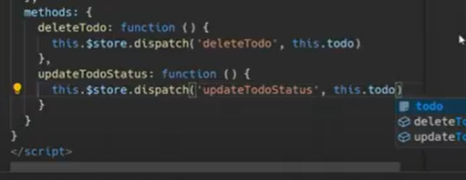

부를 

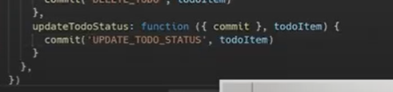

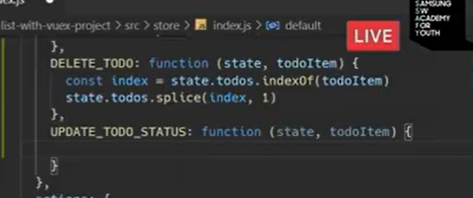

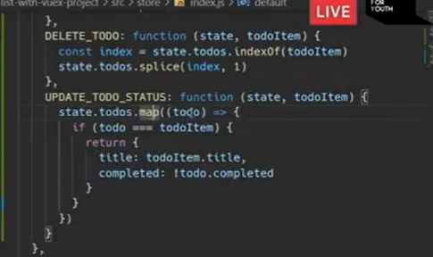

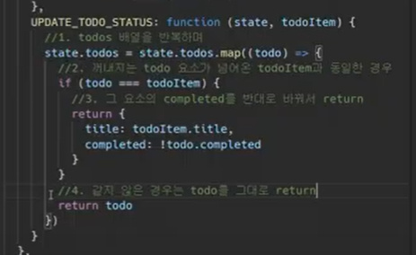

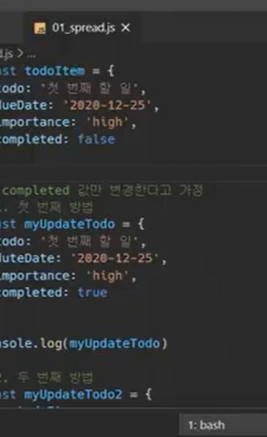

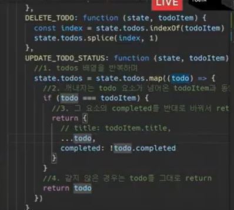

취소선 긋기

v-vi

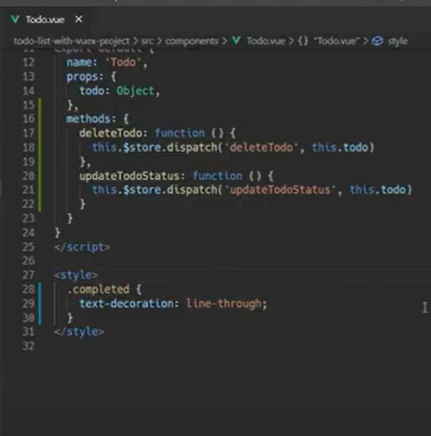

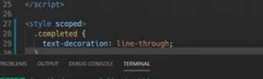

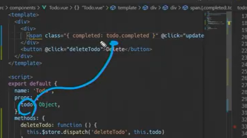

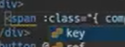

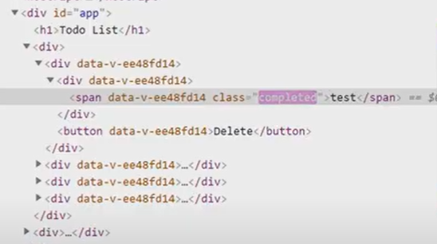

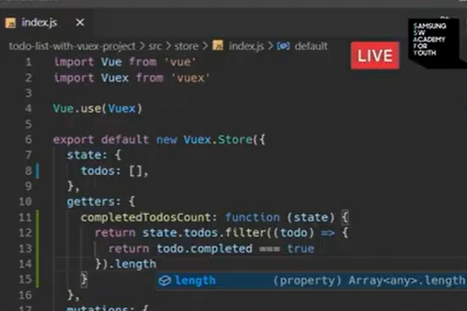

계산ㄴ된 값을 보여주자

app.vue에서

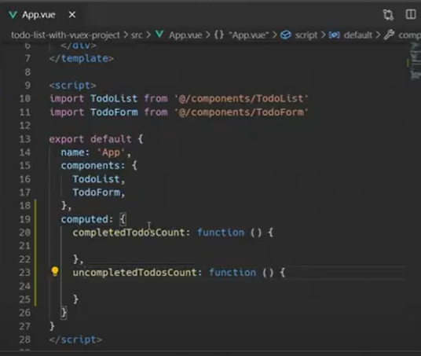

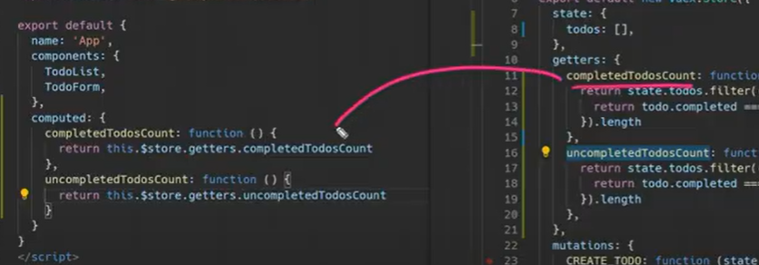

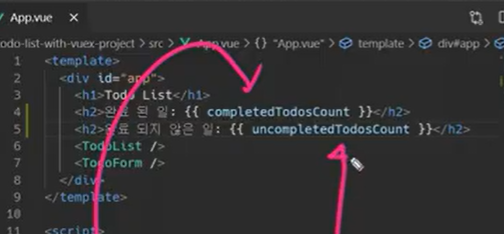

총 수 만들기

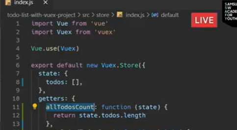

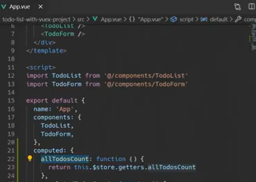

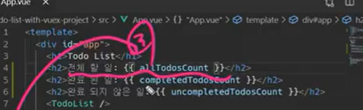

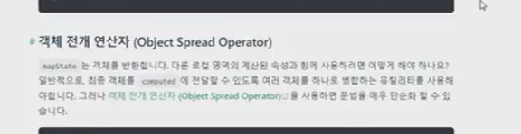

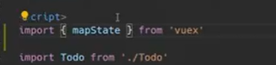

  

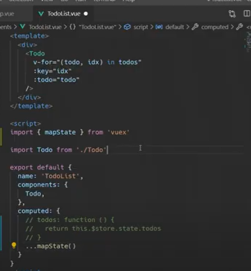

주석처리하고...mapState추가

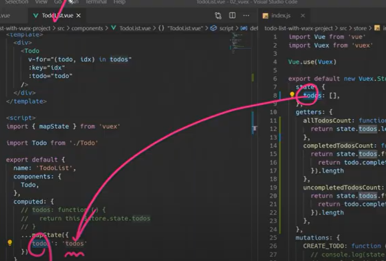

index에서 가져옴!

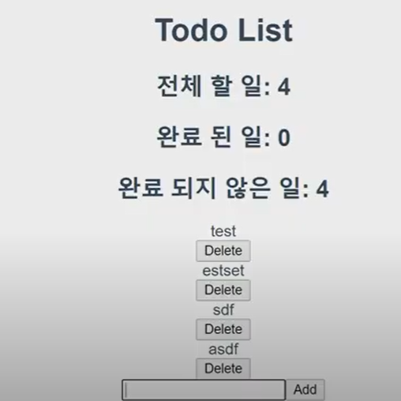

정상적으로 잘나온다

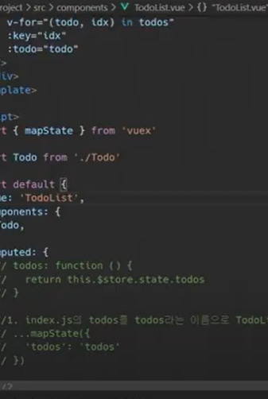

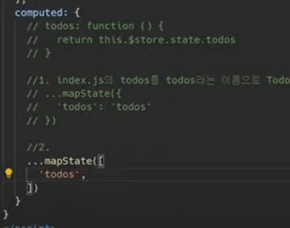

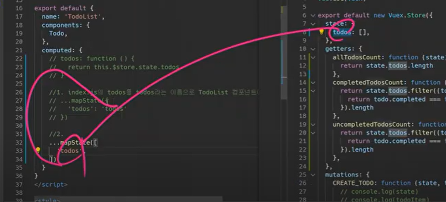

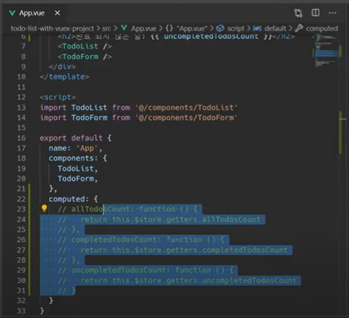

앱 주석처리

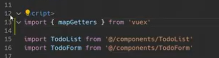

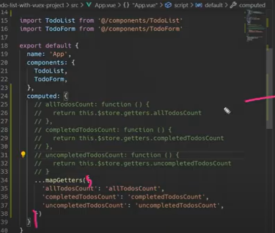

첫번째 map Getters

 

! [image-20201113154312348](Vuex.assets/image-20201113154312348.png)

---

배포

11.13 금요일

홈워크

2.

action  비동기적인 것도 들어감

mutation 만으로 해결이안된다

action 사용

3. vuex.$store

   state.count++

   context.commit('increment')