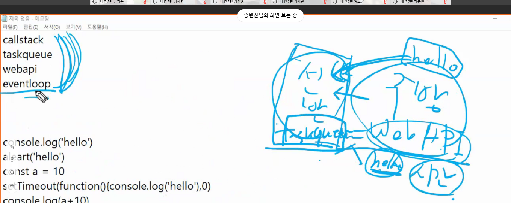
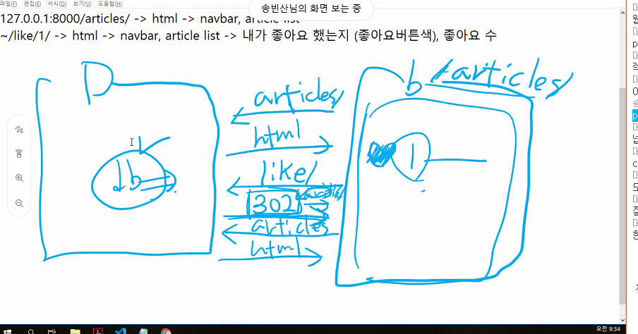
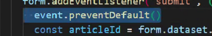
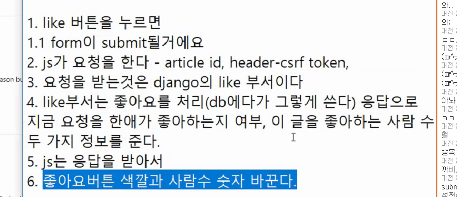
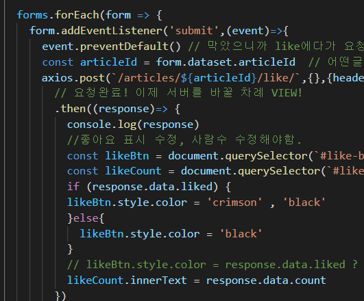
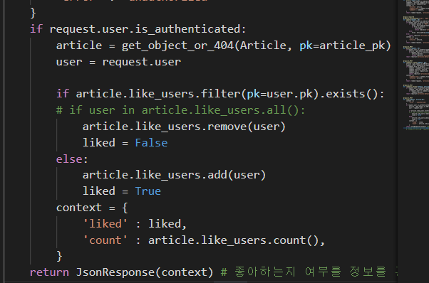

s

주석

---

시작

1. script 태크를 기입한다.
2. 

3. 

> 바디태그가 추가된 것을 확인한다.

코드를 가져와서 내가 자바스크립트로 조정을 할 수 가 있다는 것을 명심!

> header와 section을 가져온다!

확인 ㅎ

클래스를 달아준다!

클래스 달아주는 방법 2가지

classlist를 많이 사용한다!.

div 박스 각각에 스타일링을 추가한 코드..

해당하는 인풋태그를 가져올 수 있다.

마진 7 주면 움직임

할 수 있따.

이미직 가져오는 방법

> 넓이 조정

> 태그만들기!

많이 쓰임!! 

todo crud 

> 기본

> 태그만 만들어주는 태그

값을 입력하기 위해선

ul 에 li를 집어넣다.

 c/r  완료

> 결과는 나오지않는다.. 이유는?!

함수를 호출화해서 사용해야한다!

선언형과 표현형이있따.

선언형으로 간다.

function addTodo () {

}

써넣고 입력하는 것이 가능해졌다.

호출 가능!

하지만 원하는 것은 todo를 클릭했을 경우 목록에 나오게 해야한다.

어떻게 하면 될까?

event listner 를 사용하자

ET  >> button을 잡아야함.

함수 밑에 button을 적는다!

이상하게 된다.. 

이벤트 객체가 나오게 된다.

수정!

이제야 된다..하지만

전에 입력한 것을 사라지게 만들어주면 좋겠지

 

엔터를 치면 검색이 되게끔만들자

~할때 ~하자

addeventlisener

> 왜이럴까?
>
> key가 down될때 출력

비어있어도 값이 들어가는것을 방지하기 위해서는 막아줘야한다.

> 막았따
>
> 

> 경고창 뜨게한다.

> 바꿈

cr 끝!

ud 실행

1.

2번쨰 컨테인사용!

토글사용방법!

delete!

---

hw

추가기능설정 시 

완성..한글은 중복되느 글자 필요..

보충 1번

2번

3번

style에 .class = 'blue'를 넣어줘야가능하다..

4번..

 같다

> event.target.value .

---

20201014

> 코드의 흐름

jabascript 이 일을 하는데 web api 에게 일을 맡긴다.

taskqueue에 할일을 잠시 올려놓고 eventloop가 일을 관리하고있다.

javascipt이 일을 다 하면  eventloop가 javascript에게 일을 줘서 일을하게한다.! 

---

2020-10-15

> 302 는 redirect 요청을 말한다. 브라우저에서 articles로 요청이 오면 django는 html 을 보내준다.
>
> like 표시를 brouser에서 받으면 장고는 302를 표현!
>
> 302는 articles로 redirect시켜서 html 을 다시 보내준다.
>
> 이때 모든 html을 보내면 데이터 낭비가 심하다. 우리에게 필요한건 좋아요표시와, 몇명이 좋아요했는지만 알려주면 된다.

좋아요 표시를 위해 작성할 로직..

분석분석

like 버튼을 누르면 form이 sub될 것이다.

기본동작을 보고있으려니까 brouser가 요청을 해버린다. java가 아니라

그래서 이것을 막은 것이다.

요청을 하려보니까 어떤 article_form인지 알아내야한다.

기존 코드에선 정해져있지않았다. 그래서 이 폼에다가 정보를 주기 위해

form 에 클라스를 달았다..

axios.post(url, data, headers) 장고 공식문서 참조함.

follow버튼을 누르면 

form이 submit될거다

js 요청을 해

article,id, header -csrf token

django account/follw부서이다.

 follow부서는 팔로우를 처리에 대한 응답으로 팔로우 한애가 팔로우하는지, 팔로한 사람 수 두가지 정보를 요청한다.

js는 응답받아서

 팔로우 사람 숫자만 바꾼다.

자기자신은 팔로우할 수 없다.

