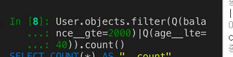
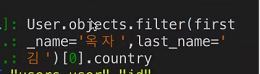
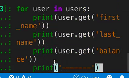

squlite 3 >다 가져올때

id == 100번째 친구 찾을 때!

orm에선 다 가져올 때!

User.objects.all() 

id ==100을 찾을 때,  User.objects.get

squlite 수정 시에!

orm 수정 시! 

user = User.objects.get(pk = 100)

담아 놓고 user.last_name  = 김이었음

박씨로 바꾸고 싶으면

user.last_name  = ''박''

그러면 바뀜!

squlite 

DELETE FORM users_user WHERE id = 100:

삭제

조회해보니 아무것도 뜨지않는다!

SELECT * FROM users_user WHERE id = 100;

orm == user.delete() 삭제!

user는 삭제!

sqlite3

나이가 30인 사람의 이름

SELECT first_name FROM users_user WHERE age = 30;

orm의 경우

user = User.objects.filter(age = 30).values('first_name')

나이가 많은 순서대로 10명까지 나열

전체평균나이 구하기.

ORM = 

SELECT AVG(age) FROM users_user;

전체 나이의 평균값을 확인 가능하다.

폴더 압직 풀고 migrtae

데이터기입

확인

과제!!

1.User.objects.all()

3.User.objects.all().values('age') or User.objects.values('age')!

5. User.objects.filter(last_name = '김', balance __gte=500).values('first_name') (values없어도댐)

7. or조건일 때 Q를 써야한다. | 는 파이프!기호

User.objects.filter(Q(balance__gte=2000)|Q(age __lte = 40)).count()

9. user = User.objects.get(first_name = '옥자', last_name='김')
   user.country = '경기도'
   user.save()

 or  교수님버전!

User.objects.filter(first_name = '옥자', last_name = '김') .update(country = '경기도')

확인방법은 아래사진!

11.users = User.objects.order_by('-balance').values('first_name' , 'last_name', 'balance')[:4]

for user in users:

print(user.get('first_name'))

엔터2번치면 명령안으로 들어감!

13. User.objects.filter(phone__startswith='010').values('country').distinct()

15. User.objects.filter(last_name = '박').aggregate(Avg('balance'))

17. User.objects.filter(country = '제주특별자치도').order_by('-balance').values('first_name')[0]